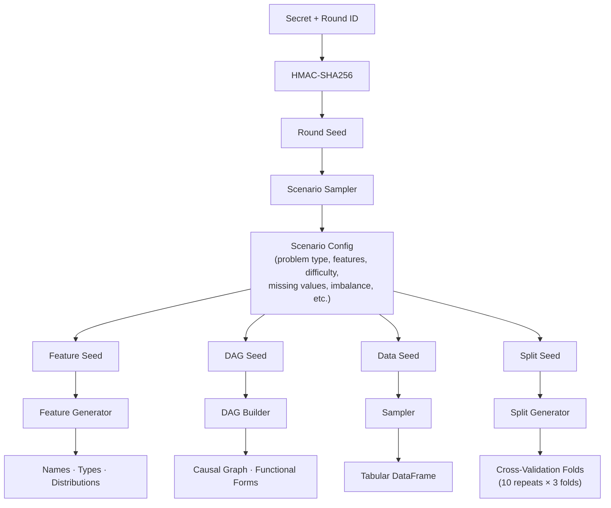

# tabular-bank

A contamination-proof tabular ML benchmark — drop-in replacement for [TabArena](https://github.com/autogluon/tabarena) with procedurally generated synthetic datasets.

## Why tabular-bank?

TabArena is the leading benchmark for tabular ML models, but it uses real-world datasets that may be contaminated in LLM/foundation model training data. `tabular-bank` solves this by generating datasets **procedurally from a secret seed** — the repo contains only the generation engine. No dataset-specific information is ever committed.

### Anti-Contamination Architecture

- **Procedural everything**: Feature names, DAG topology, distributions, functional forms, coefficients, noise — all generated from the seed
- **Cryptographic seed derivation**: HMAC-SHA256 ensures datasets are unpredictable without the master secret
- **Rotating benchmark rounds**: Each round uses a fresh seed; past rounds' seeds are published after expiry
- **Auditable fairness**: All generation code is public — anyone can verify the engine is unbiased

## Installation

```bash
pip install tabular-bank

# With TabArena integration for official benchmarking
pip install "tabular-bank[benchmark]"
```

## Quick Start

### Generate Datasets

```bash
# Via CLI
tabular-bank generate --round round-001 --secret "your-secret" --n-scenarios 10

# Via Python
from tabular_bank.generation.generate import generate_all
generate_all(master_secret="your-secret", round_id="round-001", n_scenarios=10)
```

### Run a Benchmark

```python
from sklearn.ensemble import GradientBoostingClassifier, RandomForestClassifier
from tabular_bank.context import TabularBankContext
from tabular_bank.runner import run_benchmark
from tabular_bank.leaderboard import generate_leaderboard, format_leaderboard

# Models to benchmark
models = {
    "GBM": GradientBoostingClassifier(n_estimators=100),
    "RF": RandomForestClassifier(n_estimators=100),
}

# Run benchmark
result = run_benchmark(
    models=models,
    round_id="round-001",
    master_secret="your-secret",
)

# Generate leaderboard
leaderboard = generate_leaderboard(result)
print(format_leaderboard(leaderboard))
```

### Inspect Datasets

```bash
tabular-bank info --round round-001
```

You can also set `TABULAR_BANK_SECRET` and `TABULAR_BANK_CACHE` in the environment.
Legacy `SYNTHETIC_TAB_SECRET` / `SYNTHETIC_TAB_CACHE` names are still accepted.

## Architecture



## Parametric Scenario Sampling

Rather than fixed hand-crafted templates, `tabular-bank` samples all scenario parameters from a continuous space (CausalProfiler-inspired coverage guarantee). Any valid configuration has non-zero probability of being generated, producing diverse, non-redundant benchmark tasks.

**Sampled axes include:**
- Problem type: binary classification, multiclass, regression
- Feature count, sample size, categorical ratio
- Difficulty: noise scale, nonlinearity probability, interaction probability, DAG edge density
- DAG complexity: confounder count and strength, max parent count
- Missing values: rate and mechanism (MCAR / MAR / MNAR)
- Class imbalance ratio (binary tasks)
- Temporal autocorrelation in root features
- Root feature correlations (multivariate Gaussian)

```python
from tabular_bank.generation.engine import generate_sampled_datasets

datasets = generate_sampled_datasets(
    master_secret="your-secret",
    round_id="round-001",
    n_scenarios=20,
)
```

## TabArena Compatibility

`tabular-bank` is designed as a drop-in replacement for TabArena. Generated datasets can be converted to TabArena's `UserTask` format for use with TabArena's full evaluation pipeline (8-fold bagging, standardized HPO, ELO leaderboards).

```python
ctx = TabularBankContext(round_id="round-001", master_secret="your-secret")
tabarena_tasks = ctx.get_tabarena_tasks()  # Requires tabarena package
```

## License

Apache-2.0
