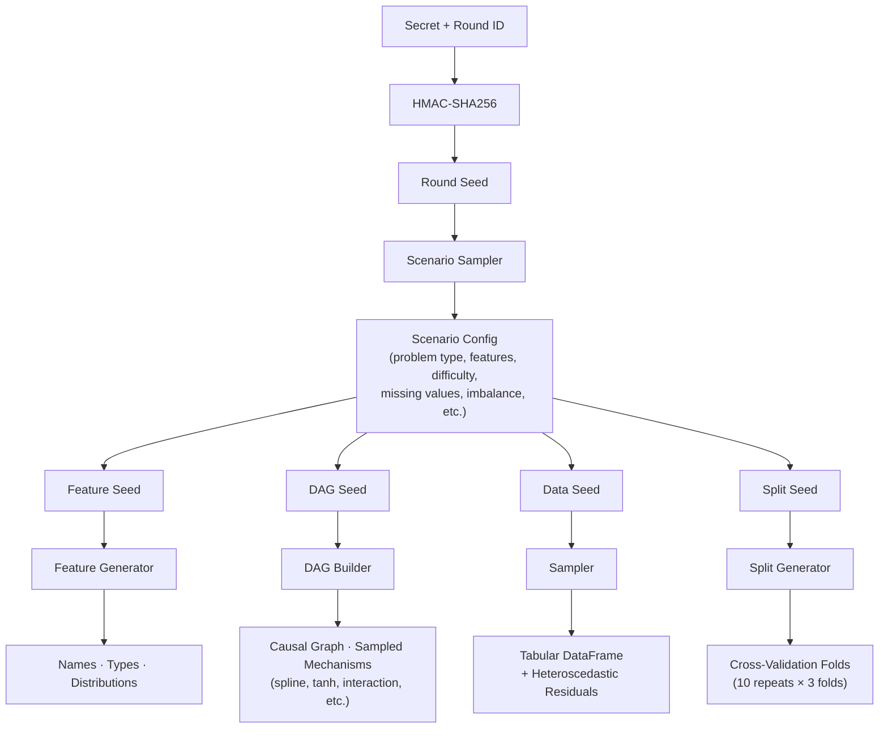

# tabular-bank

A contamination-proof tabular ML benchmark with procedurally generated synthetic datasets, TabArena-compatible evaluation, and official round/leaderboard tooling.

## Why tabular-bank?

TabArena is the leading benchmark for tabular ML models, but it uses real-world datasets that may be contaminated in LLM/foundation model training data. `tabular-bank` solves this by generating datasets **procedurally from a secret seed** — the repo contains only the generation engine. No dataset-specific information is ever committed.

### Anti-Contamination Architecture

- **Procedural structure**: Feature specs, DAG topology, mechanism families, coefficients, and noise models are generated from the seed
- **Cryptographic seed derivation**: HMAC-SHA256 ensures datasets are unpredictable without the master secret
- **Rotating benchmark rounds**: Each round uses a fresh seed; past rounds' seeds are published after expiry
- **Auditable fairness**: All generation code is public — anyone can verify the engine is unbiased

## Installation

```bash
pip install tabular-bank

# With TabArena integration for official benchmarking
pip install "tabular-bank[benchmark]"

# Optional tabular foundation-model baseline support
pip install "tabular-bank[foundation]"
```

## Quick Start

### Generate Datasets

```bash
# Via CLI (generates and caches datasets to disk)
tabular-bank generate --round round-001 --secret "your-secret" --n-scenarios 10
```

```python
# Via Python (in-memory)
from tabular_bank.generation.engine import generate_sampled_datasets

datasets = generate_sampled_datasets("your-secret", round_id="round-001", n_scenarios=10)

# Via Python (generate and cache to disk, returns list of paths)
from tabular_bank.generation.generate import generate_all

paths = generate_all(master_secret="your-secret", round_id="round-001", n_scenarios=10)
```

### Run a Benchmark

```python
from sklearn.ensemble import (
    GradientBoostingClassifier, GradientBoostingRegressor,
    RandomForestClassifier, RandomForestRegressor,
)
from tabular_bank.runner import run_benchmark
from tabular_bank.leaderboard import generate_leaderboard, format_leaderboard

# Models to benchmark (include both classifiers and regressors
# so all task types — binary, multiclass, and regression — are covered)
models = {
    "GBM-clf": GradientBoostingClassifier(n_estimators=100),
    "RF-clf": RandomForestClassifier(n_estimators=100),
    "GBM-reg": GradientBoostingRegressor(n_estimators=100),
    "RF-reg": RandomForestRegressor(n_estimators=100),
}

# Run benchmark
result = run_benchmark(
    models=models,
    round_id="round-001",
    master_secret="your-secret",
)

# Generate leaderboard
leaderboard = generate_leaderboard(result)
print(format_leaderboard(leaderboard))
```

### Inspect Datasets

```bash
tabular-bank info --round round-001
```

### Validate, Rank, and Publish a Round

```bash
# Validate round artifacts and write validation_report.json
tabular-bank validate --round round-001

# Run official checked-in baselines
tabular-bank run-baselines --round round-001

# Build a static leaderboard site
tabular-bank build-board --round round-001 --output-dir ./site
```

Generated official artifacts live under the round cache directory:

- `round_manifest.json`
- `validation_report.json`
- `official_baselines/results.csv`
- `official_baselines/methods.json`
- `official_baselines/run_manifest.json`

You can also set `TABULAR_BANK_SECRET` and `TABULAR_BANK_CACHE` in the environment.
Legacy `SYNTHETIC_TAB_SECRET` / `SYNTHETIC_TAB_CACHE` names are still accepted.

## Architecture



## Customizing Generated Datasets

Every scenario parameter can be overridden via `scenario_space` — pass only the keys you want to change and the rest keep their defaults.

```python
from tabular_bank.generation.engine import generate_sampled_datasets

# Large datasets with many features
datasets = generate_sampled_datasets(
    "your-secret",
    n_scenarios=5,
    scenario_space={
        "n_samples_range": (50000, 100000),
        "n_features_range": (50, 200),
    },
)

# Only regression tasks, no missing values
datasets = generate_sampled_datasets(
    "your-secret",
    n_scenarios=10,
    scenario_space={
        "problem_type_weights": {"regression": 1.0},
        "missing_rate_range": (0.0, 0.0),
    },
)

# Easy, low-noise binary classification
datasets = generate_sampled_datasets(
    "your-secret",
    n_scenarios=10,
    scenario_space={
        "problem_type_weights": {"binary": 1.0},
        "noise_scale_range": (0.05, 0.15),
        "nonlinear_prob_range": (0.0, 0.1),
    },
)
```

The same works from the CLI with `--set`:

```bash
tabular-bank generate --secret "your-secret" --n-scenarios 5 \
    --set n_samples_range=50000,100000 \
    --set n_features_range=50,200
```

**All configurable axes:**

| Key | Default | Description |
|-----|---------|-------------|
| `problem_type_weights` | `{binary: .45, multiclass: .25, regression: .3}` | Probability of each task type |
| `n_samples_range` | `(1000, 15000)` | Row count range |
| `n_features_range` | `(5, 30)` | Feature count range |
| `n_classes_range` | `(3, 8)` | Number of classes (multiclass) |
| `categorical_ratio_range` | `(0.1, 0.6)` | Fraction of categorical features |
| `noise_scale_range` | `(0.1, 1.0)` | Label noise intensity |
| `nonlinear_prob_range` | `(0.05, 0.6)` | Probability of nonlinear edge mechanisms |
| `interaction_prob_range` | `(0.0, 0.3)` | Probability of interaction effects |
| `missing_rate_range` | `(0.0, 0.15)` | Fraction of missing values |
| `missing_mechanisms` | `[MCAR, MAR, MNAR]` | Missing-data mechanisms to sample from |
| `edge_density_range` | `(0.45, 0.65)` | DAG edge density |
| `max_parents_range` | `(2, 6)` | Max parents per node in the DAG |
| `n_confounders_range` | `(0, 4)` | Number of latent confounders |
| `imbalance_ratio_range` | `(0.05, 0.5)` | Class imbalance (binary tasks) |

## Parametric Scenario Sampling

Rather than fixed hand-crafted templates, `tabular-bank` samples all scenario parameters from a continuous space (CausalProfiler-inspired coverage guarantee). Any valid configuration has non-zero probability of being generated, producing diverse, non-redundant benchmark tasks.

Edges no longer draw from a tiny fixed "form" enum alone. Each edge samples a
structured mechanism specification, with families including linear, threshold,
sigmoid, tanh, piecewise-linear, sinusoidal, spline, and interaction effects.
Non-root nodes can also sample heteroscedastic residual noise models whose
variance depends on one of their parents.

## Evaluation Framework

Beyond leaderboard rankings, `tabular-bank` includes a multi-dimensional evaluation framework:

### Baselines (3 tracks)

| Track | Models | Install |
|-------|--------|---------|
| **Classical** | RandomForest, GradientBoosting, LogisticRegression, Ridge, KNN, MLP | always available |
| **Boosting** | XGBoost, LightGBM, CatBoost | `pip install tabular-bank[boosting]` |
| **Foundation** | TabPFN | `pip install tabular-bank[foundation]` |

### Meta-Evaluation

```python
from tabular_bank.evaluation import run_meta_eval

report = run_meta_eval(benchmark_result)
print(report.summary())
```

Includes: discriminability scoring, task diversity, ranking concordance, and **continuous IRT analysis** (per-task difficulty and discrimination, per-model ability).

### Ground-Truth Feature Importance

Because we *know* the causal DAG, we can compute exact feature importance and compare it against model estimates — a capability unique to procedural benchmarks.

```python
from tabular_bank.evaluation.feature_importance import (
    compute_ground_truth_importance, evaluate_importance_fidelity,
    get_permutation_importance,
)

# Ground truth from the DAG
profile = compute_ground_truth_importance(dag, feature_names)

# Compare against model's permutation importance
estimated = get_permutation_importance(model, X_test, y_test)
fidelity = evaluate_importance_fidelity(profile, estimated, "GBM")
```

### Contamination Analysis

Detect memorization by comparing model rankings on tabular-bank (contamination-proof) vs. a reference benchmark:

```python
from tabular_bank.evaluation import analyze_contamination

report = analyze_contamination(tbank_scores, reference_scores, memorization_prone=["TabPFN"])
print(report.summary())  # MSI, per-model rank gaps, flagged models
```

### Dimension-Aware Diagnostics

Analyze model performance along individual difficulty axes (noise, nonlinearity, confounders, etc.):

```python
from tabular_bank.evaluation.diagnostics import run_diagnostics

report = run_diagnostics(task_scores, task_metadata)
print(report.summary())  # Per-model correlations with each difficulty dimension
```

### Scaling Analysis

Bootstrap-based analysis of ranking stability:

```python
from tabular_bank.evaluation import analyze_scenario_scaling, analyze_ranking_variance

# How many tasks for stable rankings?
scaling = analyze_scenario_scaling(task_scores, scenario_counts=[5, 10, 15, 20])

# Per-model rank confidence intervals
variance = analyze_ranking_variance(task_scores, n_bootstrap=500)
```

### Distribution Shift

Test model robustness under controlled distribution shift:

```python
from tabular_bank.generation.shift import create_shifted_splits

splits = create_shifted_splits(df, feature_names, target)
# Returns: {"none": (train, test), "covariate": ..., "concept": ..., "temporal": ...}
```

## TabArena Integration

`tabular-bank` datasets are fully compatible with [TabArena](https://github.com/autogluon/tabarena)'s evaluation pipeline. Any code that consumes TabArena datasets can also consume tabular-bank datasets — just swap the data source.

### Quick: Run TabArena Pipeline on Synthetic Data

```python
from tabular_bank.runner import run_benchmark_tabarena
from tabular_bank.leaderboard import generate_leaderboard_standalone
from tabular_bank.context import TabularBankContext

# Generate & evaluate (uses LightGBM + RandomForest by default)
results = run_benchmark_tabarena(
    round_id="round-001",
    master_secret="your-secret",
    n_scenarios=5,
)

# Generate leaderboard
ctx = TabularBankContext(round_id="round-001", master_secret="your-secret", n_scenarios=5)
leaderboard = generate_leaderboard_standalone(results, ctx.get_task_metadata())
print(leaderboard)
```

### Custom Experiments

```python
from tabarena.benchmark.experiment import AGModelBagExperiment
from autogluon.tabular.models import LGBModel

experiments = [
    AGModelBagExperiment(
        name="LightGBM_tuned",
        model_cls=LGBModel,
        model_hyperparameters={"learning_rate": 0.05},
        num_bag_folds=8,
        time_limit=3600,
    ),
]

results = run_benchmark_tabarena(
    round_id="round-001",
    master_secret="your-secret",
    experiments=experiments,
)
```

### Direct Task Conversion

For existing TabArena workflows, convert tasks directly:

```python
ctx = TabularBankContext(round_id="round-001", master_secret="your-secret")
user_tasks = ctx.get_tabarena_tasks()        # List of TabArena UserTask objects
task_metadata = ctx.get_task_metadata()       # DataFrame for ExperimentBatchRunner
```

## License

Apache-2.0
