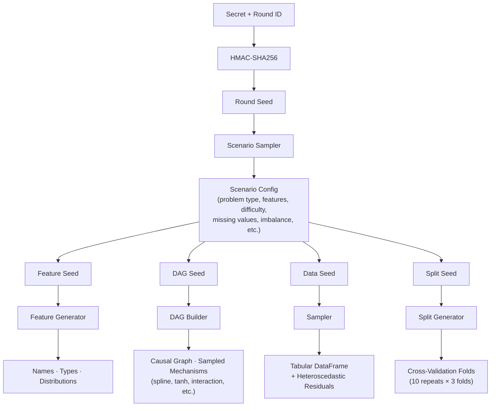

# tabular-bank

A contamination-proof tabular ML benchmark — drop-in replacement for [TabArena](https://github.com/autogluon/tabarena) with procedurally generated synthetic datasets.

## Why tabular-bank?

TabArena is the leading benchmark for tabular ML models, but it uses real-world datasets that may be contaminated in LLM/foundation model training data. `tabular-bank` solves this by generating datasets **procedurally from a secret seed** — the repo contains only the generation engine. No dataset-specific information is ever committed.

### Anti-Contamination Architecture

- **Procedural structure**: Feature specs, DAG topology, mechanism families, coefficients, and noise models are generated from the seed
- **Cryptographic seed derivation**: HMAC-SHA256 ensures datasets are unpredictable without the master secret
- **Rotating benchmark rounds**: Each round uses a fresh seed; past rounds' seeds are published after expiry
- **Auditable fairness**: All generation code is public — anyone can verify the engine is unbiased

## Installation

```bash
pip install tabular-bank

# With TabArena integration for official benchmarking
pip install "tabular-bank[benchmark]"
```

## Quick Start

### Generate Datasets

```bash
# Via CLI (generates and caches datasets to disk)
tabular-bank generate --round round-001 --secret "your-secret" --n-scenarios 10
```

```python
# Via Python (in-memory)
from tabular_bank.generation.engine import generate_sampled_datasets

datasets = generate_sampled_datasets("your-secret", round_id="round-001", n_scenarios=10)

# Via Python (generate and cache to disk, returns list of paths)
from tabular_bank.generation.generate import generate_all

paths = generate_all(master_secret="your-secret", round_id="round-001", n_scenarios=10)
```

### Run a Benchmark

```python
from sklearn.ensemble import (
    GradientBoostingClassifier, GradientBoostingRegressor,
    RandomForestClassifier, RandomForestRegressor,
)
from tabular_bank.runner import run_benchmark
from tabular_bank.leaderboard import generate_leaderboard, format_leaderboard

# Models to benchmark (include both classifiers and regressors
# so all task types — binary, multiclass, and regression — are covered)
models = {
    "GBM-clf": GradientBoostingClassifier(n_estimators=100),
    "RF-clf": RandomForestClassifier(n_estimators=100),
    "GBM-reg": GradientBoostingRegressor(n_estimators=100),
    "RF-reg": RandomForestRegressor(n_estimators=100),
}

# Run benchmark
result = run_benchmark(
    models=models,
    round_id="round-001",
    master_secret="your-secret",
)

# Generate leaderboard
leaderboard = generate_leaderboard(result)
print(format_leaderboard(leaderboard))
```

### Inspect Datasets

```bash
tabular-bank info --round round-001
```

You can also set `TABULAR_BANK_SECRET` and `TABULAR_BANK_CACHE` in the environment.
Legacy `SYNTHETIC_TAB_SECRET` / `SYNTHETIC_TAB_CACHE` names are still accepted.

## Architecture



## Customizing Generated Datasets

Every scenario parameter can be overridden via `scenario_space` — pass only the keys you want to change and the rest keep their defaults.

```python
from tabular_bank.generation.engine import generate_sampled_datasets

# Large datasets with many features
datasets = generate_sampled_datasets(
    "your-secret",
    n_scenarios=5,
    scenario_space={
        "n_samples_range": (50000, 100000),
        "n_features_range": (50, 200),
    },
)

# Only regression tasks, no missing values
datasets = generate_sampled_datasets(
    "your-secret",
    n_scenarios=10,
    scenario_space={
        "problem_type_weights": {"regression": 1.0},
        "missing_rate_range": (0.0, 0.0),
    },
)

# Easy, low-noise binary classification
datasets = generate_sampled_datasets(
    "your-secret",
    n_scenarios=10,
    scenario_space={
        "problem_type_weights": {"binary": 1.0},
        "noise_scale_range": (0.05, 0.15),
        "nonlinear_prob_range": (0.0, 0.1),
    },
)
```

The same works from the CLI with `--set`:

```bash
tabular-bank generate --secret "your-secret" --n-scenarios 5 \
    --set n_samples_range=50000,100000 \
    --set n_features_range=50,200
```

**All configurable axes:**

| Key | Default | Description |
|-----|---------|-------------|
| `problem_type_weights` | `{binary: .45, multiclass: .25, regression: .3}` | Probability of each task type |
| `n_samples_range` | `(1000, 15000)` | Row count range |
| `n_features_range` | `(5, 30)` | Feature count range |
| `n_classes_range` | `(3, 8)` | Number of classes (multiclass) |
| `categorical_ratio_range` | `(0.1, 0.6)` | Fraction of categorical features |
| `noise_scale_range` | `(0.1, 1.0)` | Label noise intensity |
| `nonlinear_prob_range` | `(0.05, 0.6)` | Probability of nonlinear edge mechanisms |
| `interaction_prob_range` | `(0.0, 0.3)` | Probability of interaction effects |
| `missing_rate_range` | `(0.0, 0.15)` | Fraction of missing values |
| `missing_mechanisms` | `[MCAR, MAR, MNAR]` | Missing-data mechanisms to sample from |
| `edge_density_range` | `(0.45, 0.65)` | DAG edge density |
| `max_parents_range` | `(2, 6)` | Max parents per node in the DAG |
| `n_confounders_range` | `(0, 4)` | Number of latent confounders |
| `imbalance_ratio_range` | `(0.05, 0.5)` | Class imbalance (binary tasks) |

## Parametric Scenario Sampling

Rather than fixed hand-crafted templates, `tabular-bank` samples all scenario parameters from a continuous space (CausalProfiler-inspired coverage guarantee). Any valid configuration has non-zero probability of being generated, producing diverse, non-redundant benchmark tasks.

Edges no longer draw from a tiny fixed "form" enum alone. Each edge samples a
structured mechanism specification, with families including linear, threshold,
sigmoid, tanh, piecewise-linear, sinusoidal, spline, and interaction effects.
Non-root nodes can also sample heteroscedastic residual noise models whose
variance depends on one of their parents.

## TabArena Compatibility

`tabular-bank` is designed as a drop-in replacement for TabArena. Generated datasets can be converted to TabArena's `UserTask` format for use with TabArena's full evaluation pipeline (8-fold bagging, standardized HPO, ELO leaderboards).

```python
ctx = TabularBankContext(round_id="round-001", master_secret="your-secret")
tabarena_tasks = ctx.get_tabarena_tasks()  # Requires tabarena package
```

## License

Apache-2.0
